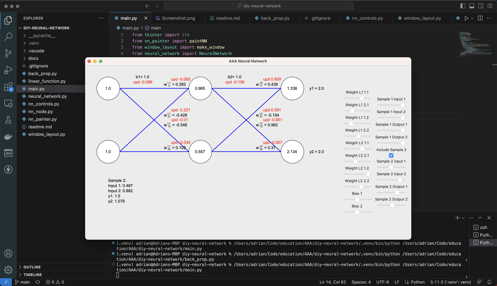
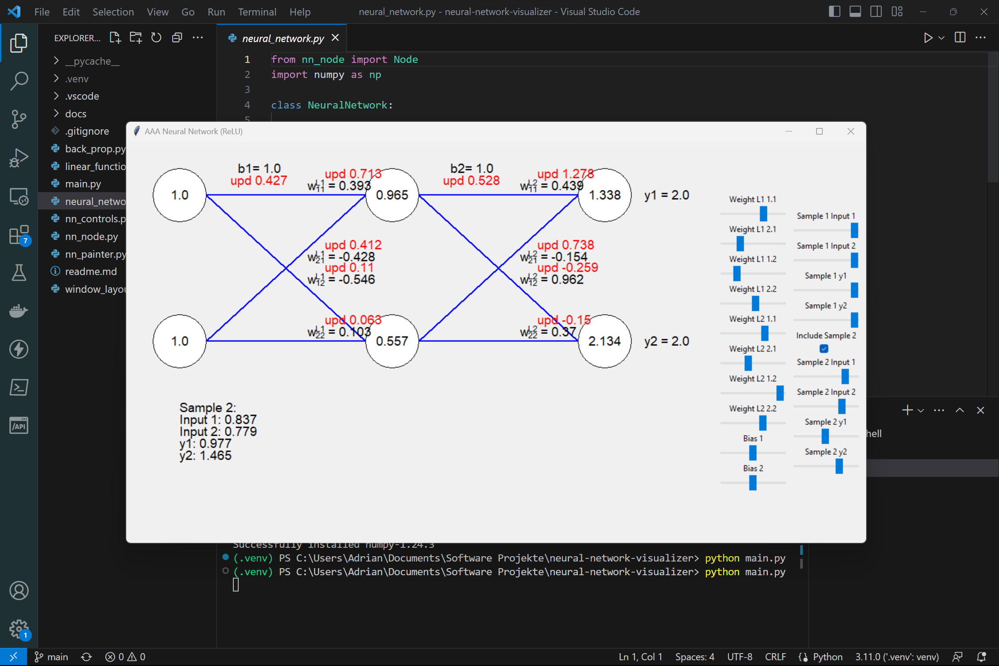

# AAA Backpropagation Task

Group name: **AAAAA**

Required libraries:
 - numpy

The back-propagation process, including all derivatives, is defined in the `back_prop.py` file.

To run this code you need the python toolkit for userinterfaces installed. With manually installed versions of python this is usually already the case. If you installed python using homebrew tkinter is not added by default. This is easily solved by:

`brew install python-tk`

Members:
 - Dominik Höller
 - Onuc Koc
 - Onno Peters
 - Justin Engelker
 - Adrian Grünberg

(Mac)

(Windows)
